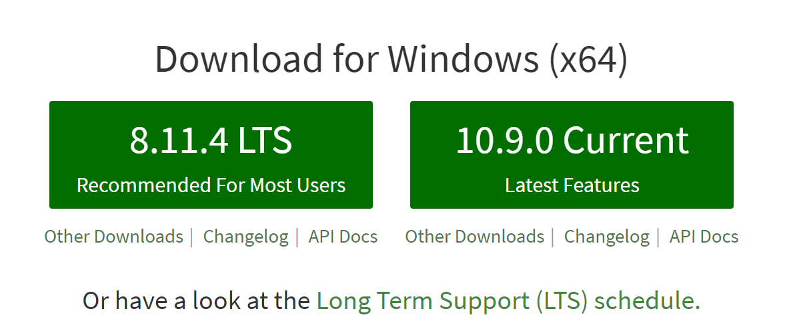
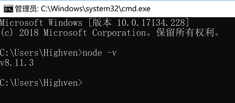
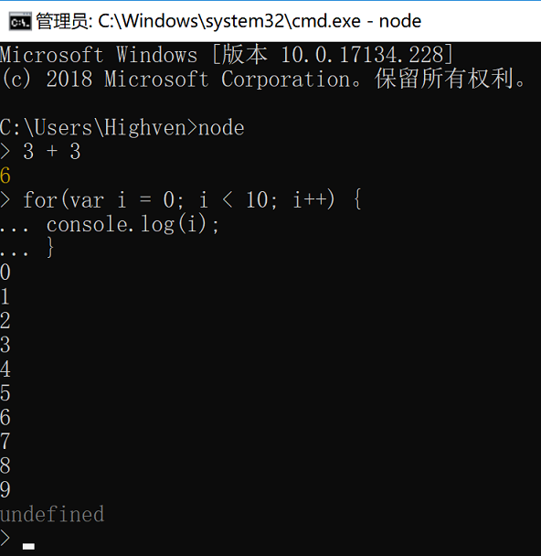
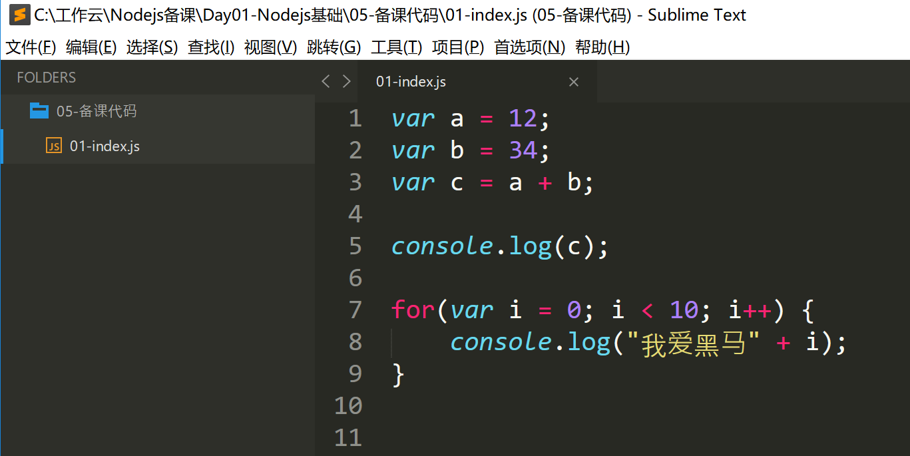
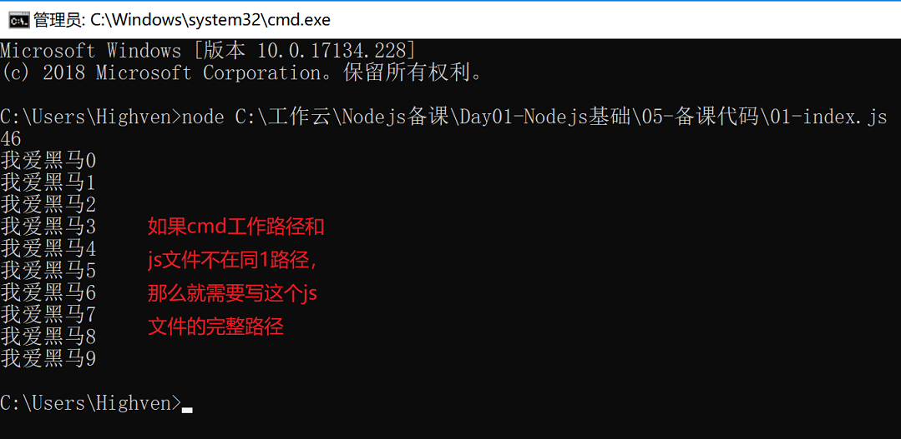
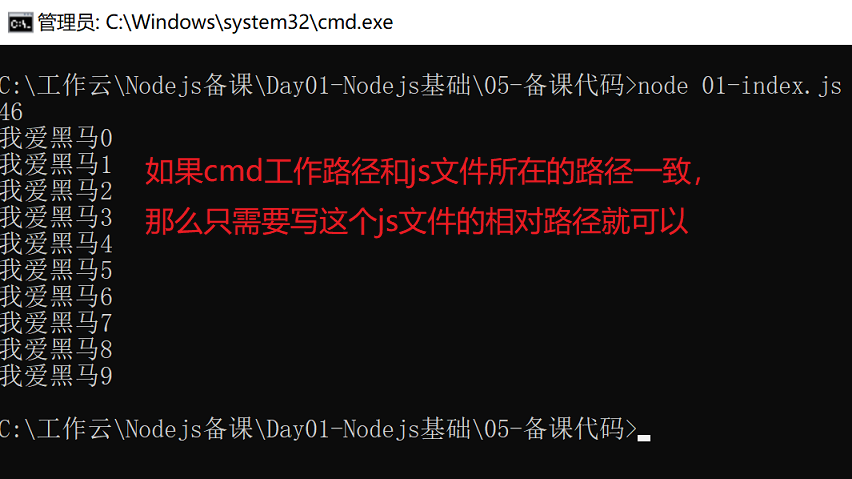
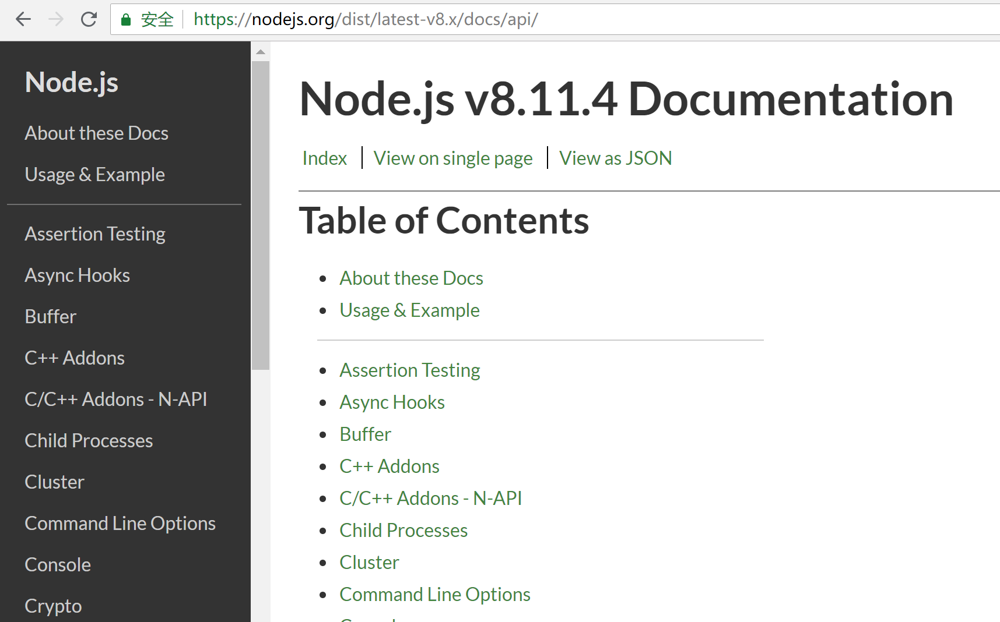

# Node基础

基于V8引擎,运行在服务器的js,异步非阻塞IO

**让js能够独立于浏览器运行**

Node主要在前端开发中用来把项目跑起来 build一下

# 01. 什么是Node

 

### 1.1 简介

 **Ryan Dahl**

> 2009年，ry正式推出了基于JavaScript语言和V8引擎的开源Web服务器项目，命名为Node.js。Node第一次把JavaScript带入到后端服务器开发，加上世界上已经有无数的JavaScript开发人员，所以Node一下子就火了起来。	 

* 以Chrome V8引擎为基石, 打造的一个全cmd新平台.
* nodejs平台是JavaScript语言运行的另外一个环境.
  * 之前我们的js代码只能依赖于浏览器环境执行
  * 现在我们的js代码还可以在nodejs平台上执行
* nodejs支持跨平台, Windows、macOS、Linux均支持.
* nodejs平台最主要的作用是用来开发高性能的Web服务器.
* nodejs是单线程异步非阻塞  
* deno node


### 1.2 资源列表

* 官方网站  http://nodejs.org
* 非官方中文网站  http://nodejs.cn
* node中文社区  https://cnodejs.org/

## 02. 安装nodejs

  

**LTS**

>  Long Term Support, 长期支持版本, 会一直不断的修复这个版本出现的Bug.   非LTS版本可能在某一时刻停止维护，即使出现了Bug也不会修复.

**Current**

> 当前最新版本, 有最新的功能和特性，有可能会将某些功能加入到LTS版本中.

	选择一个适合你的版本，下载并将其安装在你的电脑上，那么你的电脑上就具备nodejs环境了, 然后我们就可以愉快的写js代码，并将其运行在node环境之中了.
	
	测试node是否安装成功, 打开cmd工具, 输入 **node -v** 命令, 如果显示了你安装的node版本号,则表示安装成功，否则你需要重新安装.

  

 

## 03. REPL环境

>  REPL Read-Eval-Print Loop 简单的，交互式的编程环境.

node提供了一种REPL环境，允许我们在其中编写node代码，可以很快速的得到代码的执行结果，一般适用于在该环境下写一些测试代码.

打开cmd工具, 输入命令**node**就可以进入REPL环境. 在这个环境中,我们可以写入任意的node代码，并能很快速方便的看到代码执行结果.

 

## 04. 执行js文件

REPL只适合写1些短小的测试性代码，真正的node开发姿势应该是将代码些在1个js文件中，然后将这个js文件中的代码交给node去执行.

### 4.1 编写代码

使用任意的文本编辑工具或者IDE工具，在后缀名为.js的文件中编写node代码. 

### 4.2 执行代码

然后在cmd工具中使用node命令来执行这个js文件中的代码.

格式:  **node 文件路径**

在任意目录使用node命令执行js文件中的代码.



也可以先将cmd的工作目录切换到js文件所在的目录，这个时候使用node命令执行该js文件的时候，只需要些这个js文件的相对路径就可以了.



无论使用哪种方式，最终我们的js代码，都在node平台上被执行了.


## 05. node端的js

	nodejs平台底层是基于Chrome的V8引擎, 所以它可以执行js代码，但是需要注意的是，nodejs只是集成了ECMAScript, 并没有集成DOM、BOM，它也无法集成。所以我们之前写的和浏览器相关的DOM、BOM操作代码都不能在nodejs上执行，nodejs只提供了JavaScript语言的语法部分，比如变量、数据类型、分支、循环、对象、数组、Math对象等等，和浏览器相关的操作API都无法在node上使用.
	
	虽然如此，但是nodejs却为我们提供了更多功能强大的模块和对象，我们可以利用这些模块提供的功能打造我们强大的应用，这些模块的信息和文档我们都可以在官方网站上找到详细的说明.




## 06. let与const

ES6极力推荐开源书籍:   http://es6.ruanyifeng.com/

他们的作用和**var**关键字一样，是用来声明变量的.

```javascript
var a = 10;
let b = 20;
const c = 30;
```

* 使用let声明的变量，这个变量的值后续可以更改。
* 使用const声明的变量，这个变量的值后续是不可以更改的。

### 6.1 不存在变量提升

使用let或者const声明的变量，不会对其进行变量的提升.

### 6.2 块级作用域

在1对大括弧中，使用let或者const声明的变量，只能在这个大括弧中访问.

```javascript
{
    var a = 10;
    let b = 20;
    const c = 30;
}
console.log(a); //可以访问
console.log(b); //error b is not defined
console.log(c); //error c is not defined
```

使用let或者const可以控制变量的释放，并节约内存，建议从此摒弃var, 拥抱let和const

## 07. 箭头函数

箭头函数是普通函数的一种更为简洁的书写方式.

格式如下

(参数列表) => { 

	函数体;

}

```javascript
function getSum(a,b) {
    var sum = a + b;
    return sum;
}

const getSum = (a, b) => {
    const sum = a + b;
    return sum;
}
```

删掉function 将其替换为 =>  然后将其放到参数列表与大括弧中间. 其它与普通函数类似.

再省略形式

* 如果函数体只有一句代码，那么大括弧可以不写, 并将这句代码的结果做为返回值.

  ```javascript
  const sayHi = (name) => console.log("你好呀,"+name);
  ```

* 如果参数只有1个，那么小括弧可以不写

  ```javascript
  const sayHi = name => console.log("你好呀，"+name);
  ```

## 08. 模板字符串

> ES6之前，要声明常量字符串使用单引号或者双引号，在ES6中新增了一种声明字符串常量的方法,那就是使用一对 `` ` 号，这样声明的字符串叫做**模板字符串**

```javascript
let str1 = "jack";
let str2 = 'rose';
let str3 = `Jim`; 
```

模板字符串支持直接换行 空格

```javascript
let msg = `
	大家好，
	我叫小明.
	很高兴认识大家!
`;
```

还支持变量替换,甚至表达式结果替换

```javascript
let name1 = "杜子腾";
let name2 = "秦寿生";
let msg = `孔子东游，见两小儿辩斗，问其故。
${name1}曰：“我以日始出时去人近，而日中时远也。”
${name2}以日初出远，而日中时近也。
${name1}曰：“日初出大如车盖，及日中则如盘盂，此不为远者小而近者大乎？”
${name2}曰：“日初出沧沧凉凉，及其日中如探汤，此不为近者热而远者凉乎？”
孔子不能决也。
${name1+"和"+name2}笑曰：“孰为汝多知乎？”
`;
```


## 09. 对象快速赋值

在组装对象的时候, 如果对象的属性名和属性值都是同1个变量，那么可以简写

```javascript
let name = "jack";
let age = 18;
let gender = "男";
let p1 = {
    name: name,
    age: age,
    gender: gender
}
//像这样的情况可以简写成下面这样
let p2 = {
    name,
    age,
    gender
}
```

对象里面，我们也可以有方法

```javascript
let name = "jack";
let age = 18;
let gender = "男";
let p1 = {
    name: name,
    age: age,
    gender: gender,
    sayHi: function() { //在ES6之前 对象中的方法这样定义
        console.log("大家好，才是真的好");
    }
}
//像这样的情况可以简写成下面这样
let p2 = {
    name,
    age,
    gender,
    sayHi() { //在ES6中，对象中的方法可以直接这样写.
        console.log("大家好，才是真的好");
    }
}
```

## 10. 箭头函数中的this

在函数中的this是指谁呢?

> 这个函数通过谁点出来的，那么这个函数中的this就指向谁

```javascript
let name = "jack";
let age = 18;
let gender = "男";

let p2 = {
    name,
    age,
    gender,
    sayHi() { 
        console.log(this);
        console.log("大家好，才是真的好");
    }
}

p2.sayHi(); //sayHi方法是通过p2对象点出来的，所以sayHi方法中的this就是指的p2对象.

let p3 = {
    name,
    age,
    gender,
    sayHi() { 
        console.log(this);
        console.log("大家好，才是真的好");
        setTimeout(function(){
            console.log(this); //这里的this是指谁呢?
            //在浏览器端, setTimeout方法是通过window对象点出来的，所以是指window对象.
            //在node端,这里的this指的是Timeout对象 
        },1000);
    }
}

//之前的做法，如果我希望setTimeout中的this也指向p3对象.
let p4 = {
    name,
    age,
    gender,
    sayHi() { 
        console.log(this);
        console.log("大家好，才是真的好");
        let that = this;
        setTimeout(function(){
            console.log(that); //这里的that就指p4对象了.
        },1000);
    }
}
```

**箭头函数会在声明的时候，绑定当前作用域的this, 那么箭头函数中的this就不会改变.**

```javascript
let p1 = {
    name,
    age,
    gender,
    sayHi() { 
        console.log(this);
        console.log("大家好，才是真的好");
     	//在声明箭头函数的时候，会将当前作用域的this(p1对象)绑定到箭头函数的this
        setTimeout(() => {
            console.log(this); //这里的this就指p1对象了. this指向不会改变
        },1000);
    }
}
```

## 11. fs文件系统模块

nodejs内置了很多功能各异的模块，我们可以使用这些模块提供的功能来打造我们的应用.

接下来就为大家介绍一个`fs`模块  File System 

这个模块的功能就是用来操作磁盘上的文件系统的。

通过官方文档，你可以很详细的知道这个模块的功能以及如何使用这个模块.

要使用模块的功能，首先需要使用`require`函数将这个模块加载进来.

```javascript
const fs = require("fs");
/*
require函数的功能: 加载模块
参数： 字符串，写上你要加载的模块的名字.
返回值： 返回的就是这个模块，不同的模块返回的内容可能不同，可能是1个对象，也有可能是1个函数，需要查询文档确定
fs模块返回的就是1个对象，这个对象就提供了很多操作文件系统的函数.
*/
```

### 11.1 使用fs模块读取文件

调用`fs`模块的`readFile`方法，可以读取磁盘上指定文件的内容

`参数1:`  要读取的文件的路径

`参数2:`  可选，读取文本文件所使用的编码，如果不传，读取出来的数据就是`Buffer`类型的字节数据

`参数3:`  回调函数, 在读取文件完成后被执行，该回调函数有两个参数`err`、`data`，如果文件读取失败，那么`err`就会有值，这个`err`对象中会对失败的原因进行描述。 如果读取文件成功，那么参数`err`就为null, 参数`data`中就被读取出来的数据.

```javascript
const fs = require("fs");
fs.readFile("./data.txt","utf-8",(err,data) => {
    if(err) {
        console.log("读取文件失败，详细信息: " + err);
    }else{
        console.log("读取文件成功,读取到的内容为: " + data);
    }
})
```

### 11.2 使用fs模块写入文件

调用`fs`模块的`writeFile`方法，可以将数据写入到磁盘上的文件中.

`参数1:`  要写入到的文件的路径

`参数2:`  有写入的内容，可以是字符串，也可以是Buffer

`参数3:`   指定写入数据的时候，使用的编码。可以不传，如果不传将默认使用utf-8

`参数4:`   回调函数，该回调函数将在写入操作完成后被执行。参数只有1个 `err`  

```javascript
const fs = require("fs");
const data = "我是中国人，我爱自己的祖国！"
fs.writeFile("aa.txt",data,"utf-8",(err)=>{
	if(err) {
		throw err;
	}
	console.log("文件写入成功！");
});
```


## 12. 字符编码

计算机存储数据的最小基本单位是字节. 一个字节由8个二进制位组成

**ASCII码**

>美国，使用一个字节来保存一个字符，最多可以表示256种, 实际上他们只用到了前128位

**ISO-8859-1**

>对ASCII后128位进行了扩展，加入了拉丁文，罗马字符等.

**GB2312**

> 中国大陆地区 将汉字编码 每一个汉字占两个字节 前128位和ASCII码一致，使用1个字节表示。但是也同样使用了两个字节来对ASCII码进行了重编码  `半角`和`全角`的区别

**GB18030**

> 扩展了GB2312 加入了少数民族文字

**Big5**

> 港澳台地区 繁体中文

**GBK**

> 扩展了GB2312 兼容GB2312  还包含了繁体中文。不兼容Big5

**Unicode**

> 将全世界的文字都进行统一编码，每一个字符占用4个字节. 浪费存储空间 消耗网络性能

**UTF-8**

> 将全世界的文字都进行统一编码，只不过使用变长编码。 中文使用3个字节.

## 13. Buffer

## 14. 非阻塞式I/O模型

### 14.1 异步执行

### 14.2 同步执行


## 15. __dirname

### 15.1 path模块


## 16. 请求响应模型


## 17. HTTP协议


## 18. HTTP服务

nodejs内置了一个`http`模块, 这个模块可以启动一个http服务，来响应处理浏览器的请求

```javascript
//1. 加载http模块
const http = require("http");
//2. 创建http服务
//   这个服务具备监听浏览器请求 并处理、响应浏览器的功能
const server = http.createServer();
//3. 监听浏览器的请求
server.on("request",(req,res) => {
    //一旦监听到浏览器发过来的请求，这个回调函数就会被执行.
    //参数req:  通过这个对象，可以拿到浏览器请求服务器的时候，发送过来的数据.
    //参数res:  通过这个对象，可以操作服务器向浏览器响应的数据.
    res.write("<h1>Hello,Node.js</h1>"); //向服务器响应的数据.
    res.end();//结束本次处理，这句代码是必须的，否则不会向浏览器响应数据
});
//4. 开始监听.
//   第1个参数: 指定http服务工作的端口
//   第2个参数: 回调函数，在成功工作后执行 可以省略
server.listen(8080,()=>{
    console.log("http服务成功启动");
});

//可以使用模板字符串返回1个完整的html
```


### 18.1 详解请求、处理、响应的过程

* res.end() 为什么必须要调用.
* res.write() 并不是立即向服务器响应数据 而是将数据写入到缓存区.
* PPT动画图解.


## 19. 设置响应编码

	上面的程序其实还存在问题, 比如，当我们将返回的内容包含中文的时候. 浏览器就会解析成乱码。这是为什么呢？

### 19.1 请求头和请求体

### 19.2 响应头和响应体

浏览器在拿到服务器响应回来的数据以后，会根据响应头的标记，来解析响应体的数据，然后展示在页面上。

默认情况下，浏览器无法知道响应体的数据是什么数据，也无法知道响应体采取的编码是什么。

通过`res`对象的`setHeader`方法来设置响应头，指定文档类型和编码方式.

```javascript
server.on("request",(req,res) => {
    //设置响应头
    //指定返回的数据的文档类型为html
    //指定返回的数据使用的编码为 utf-8
    res.setHeader("Content-Type","text/html;charset=utf-8")
    res.write("<h1>你好，世界！</h1>"); 
    res.end();
});
```

返回不同类型的数据，应该使用不同的`Content-Type`

查询手册：http://tool.oschina.net/


## 20. 不同的url返回不同的内容


## 21. 处理静态资源

### 21.1 mime模块


## 22. npm的使用

### 22.1 npm

使用`npm init`或者`npm init -y`初始化项目目录，生成package.json配置文件

`npm install 包名` 下载该包的最新版本   `npm install jquery`

`npm install 包名@版本号 ` 下载指定版本的包  `npm install jquery@1.11.1`

`npm info 包名` 查询指定包的信息

`npm uninstall 包名`   删除指定包  

`npm install 包名 -g` 全局安装，只有支持全局安装的包才可以以这样的方式安装.

`--save` 和 `--save-dev`

`npm install --production` 

`npm install`


**package.json**

* scripts
* dependencies
* devDependencies

### 22.2 cnpm

```
npm install cnpm -p
//不建议使用
```


### 22.3 指定npm下载源

**命令行指定**

```
npm install vue --registry http://registry.npm.taobao.org
```

**修改配置文件**

```
npm config set registry http://registry.npmjs.org    
//设置npm下载源指定为淘宝服务器
npm config set registry https://registry.npm.taobao.org 
npm info underscore 
```


## 附录

### 1. npm报错

```
npm install --global --production windows-build-tools
```


